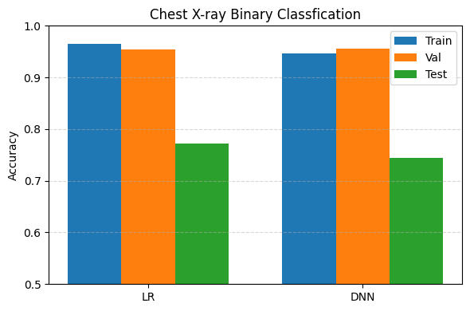

| Layer     | Input → Output  | Activation | Dropout | Parameters  |
|-----------|------------------|------------|---------|-------------|
| Linear 1  | 16,384 → 256     | ReLU       | 0.2     | 4,194,304   |
| Linear 2  | 256 → 64        | ReLU       | 0.2     | 16,384     |
| Linear 3  | 64 → 1          | Sigmoid    | ✗       | 64         |
| **Total** | —                | —          | —       | **4,210,752** |

weight_decay: 1e-4 (DNN)

# epochs: 2
## LR
[LR][Epoch 1] Train Acc: 0.86, Train Loss: 0.36
[LR][Epoch 1] Val Acc: 0.93, Val Loss: 0.20
[LR][Epoch 2] Train Acc: 0.93, Train Loss: 0.18
[LR][Epoch 2] Val Acc: 0.93, Val Loss: 0.17

## DNN
[DNN][Epoch 1] Train Acc: 0.83, Train Loss: 0.39
[DNN][Epoch 1] Val Acc: 0.88, Val Loss: 0.28
[DNN][Epoch 2] Train Acc: 0.91, Train Loss: 0.23
[DNN][Epoch 2] Val Acc: 0.94, Val Loss: 0.16

## Test
[LR] Test Acc: 0.72
[DNN] Test Acc: 0.80

# epochs: 10
## LR
[LR][Epoch 1] Train Acc: 0.88, Train Loss: 0.32
[LR][Epoch 1] Val Acc: 0.94, Val Loss: 0.17
[LR][Epoch 2] Train Acc: 0.93, Train Loss: 0.18
[LR][Epoch 2] Val Acc: 0.95, Val Loss: 0.14
[LR][Epoch 3] Train Acc: 0.94, Train Loss: 0.15
[LR][Epoch 3] Val Acc: 0.94, Val Loss: 0.15
[LR][Epoch 4] Train Acc: 0.93, Train Loss: 0.16
[LR][Epoch 4] Val Acc: 0.94, Val Loss: 0.15
[LR][Epoch 5] Train Acc: 0.95, Train Loss: 0.13
[LR][Epoch 5] Val Acc: 0.95, Val Loss: 0.13
[LR][Epoch 6] Train Acc: 0.95, Train Loss: 0.13
[LR][Epoch 6] Val Acc: 0.94, Val Loss: 0.16
[LR][Epoch 7] Train Acc: 0.96, Train Loss: 0.12
[LR][Epoch 7] Val Acc: 0.95, Val Loss: 0.11
[LR][Epoch 8] Train Acc: 0.96, Train Loss: 0.12
[LR][Epoch 8] Val Acc: 0.95, Val Loss: 0.11
[LR][Epoch 9] Train Acc: 0.96, Train Loss: 0.11
[LR][Epoch 9] Val Acc: 0.90, Val Loss: 0.24
[LR][Epoch 10] Train Acc: 0.95, Train Loss: 0.13
[LR][Epoch 10] Val Acc: 0.92, Val Loss: 0.24

## DNN
[DNN][Epoch 1] Train Acc: 0.84, Train Loss: 0.36
[DNN][Epoch 1] Val Acc: 0.89, Val Loss: 0.25
[DNN][Epoch 2] Train Acc: 0.92, Train Loss: 0.20
[DNN][Epoch 2] Val Acc: 0.93, Val Loss: 0.18
[DNN][Epoch 3] Train Acc: 0.93, Train Loss: 0.18
[DNN][Epoch 3] Val Acc: 0.94, Val Loss: 0.13
[DNN][Epoch 4] Train Acc: 0.93, Train Loss: 0.18
[DNN][Epoch 4] Val Acc: 0.94, Val Loss: 0.16
[DNN][Epoch 5] Train Acc: 0.93, Train Loss: 0.18
[DNN][Epoch 5] Val Acc: 0.95, Val Loss: 0.14
[DNN][Epoch 6] Train Acc: 0.93, Train Loss: 0.19
[DNN][Epoch 6] Val Acc: 0.94, Val Loss: 0.13
[DNN][Epoch 7] Train Acc: 0.94, Train Loss: 0.15
[DNN][Epoch 7] Val Acc: 0.94, Val Loss: 0.16
[DNN][Epoch 8] Train Acc: 0.94, Train Loss: 0.16
[DNN][Epoch 8] Val Acc: 0.93, Val Loss: 0.18
[DNN][Epoch 9] Train Acc: 0.94, Train Loss: 0.16
[DNN][Epoch 9] Val Acc: 0.95, Val Loss: 0.12
[DNN][Epoch 10] Train Acc: 0.94, Train Loss: 0.16
[DNN][Epoch 10] Val Acc: 0.95, Val Loss: 0.14

## Test
[LR] Test Acc: 0.68
[DNN] Test Acc: 0.79

# epochs: 20
## LR
[LR][Epoch 1] Train Acc: 0.83, Train Loss: 0.43
[LR][Epoch 1] Val Acc: 0.93, Val Loss: 0.20
[LR][Epoch 2] Train Acc: 0.92, Train Loss: 0.20
[LR][Epoch 2] Val Acc: 0.94, Val Loss: 0.16
[LR][Epoch 3] Train Acc: 0.93, Train Loss: 0.17
[LR][Epoch 3] Val Acc: 0.93, Val Loss: 0.18
[LR][Epoch 4] Train Acc: 0.95, Train Loss: 0.14
[LR][Epoch 4] Val Acc: 0.95, Val Loss: 0.13
[LR][Epoch 5] Train Acc: 0.95, Train Loss: 0.14
[LR][Epoch 5] Val Acc: 0.94, Val Loss: 0.13
[LR][Epoch 6] Train Acc: 0.95, Train Loss: 0.14
[LR][Epoch 6] Val Acc: 0.94, Val Loss: 0.13
[LR][Epoch 7] Train Acc: 0.95, Train Loss: 0.14
[LR][Epoch 7] Val Acc: 0.94, Val Loss: 0.17
[LR][Epoch 8] Train Acc: 0.95, Train Loss: 0.13
[LR][Epoch 8] Val Acc: 0.94, Val Loss: 0.14
[LR][Epoch 9] Train Acc: 0.96, Train Loss: 0.12
[LR][Epoch 9] Val Acc: 0.93, Val Loss: 0.18
[LR][Epoch 10] Train Acc: 0.96, Train Loss: 0.12
[LR][Epoch 10] Val Acc: 0.94, Val Loss: 0.16
[LR][Epoch 11] Train Acc: 0.95, Train Loss: 0.12
[LR][Epoch 11] Val Acc: 0.91, Val Loss: 0.24
[LR][Epoch 12] Train Acc: 0.96, Train Loss: 0.11
[LR][Epoch 12] Val Acc: 0.96, Val Loss: 0.11
[LR][Epoch 13] Train Acc: 0.96, Train Loss: 0.11
[LR][Epoch 13] Val Acc: 0.94, Val Loss: 0.19
[LR][Epoch 14] Train Acc: 0.95, Train Loss: 0.15
[LR][Epoch 14] Val Acc: 0.95, Val Loss: 0.12
[LR][Epoch 15] Train Acc: 0.96, Train Loss: 0.10
[LR][Epoch 15] Val Acc: 0.96, Val Loss: 0.11
[LR][Epoch 16] Train Acc: 0.96, Train Loss: 0.11
[LR][Epoch 16] Val Acc: 0.93, Val Loss: 0.20
[LR][Epoch 17] Train Acc: 0.95, Train Loss: 0.13
[LR][Epoch 17] Val Acc: 0.95, Val Loss: 0.16
[LR][Epoch 18] Train Acc: 0.96, Train Loss: 0.10
[LR][Epoch 18] Val Acc: 0.96, Val Loss: 0.11
[LR][Epoch 19] Train Acc: 0.96, Train Loss: 0.09
[LR][Epoch 19] Val Acc: 0.95, Val Loss: 0.11
[LR][Epoch 20] Train Acc: 0.95, Train Loss: 0.12
[LR][Epoch 20] Val Acc: 0.95, Val Loss: 0.11
## DNN
[DNN][Epoch 1] Train Acc: 0.79, Train Loss: 0.46
[DNN][Epoch 1] Val Acc: 0.85, Val Loss: 0.37
[DNN][Epoch 2] Train Acc: 0.90, Train Loss: 0.24
[DNN][Epoch 2] Val Acc: 0.94, Val Loss: 0.15
[DNN][Epoch 3] Train Acc: 0.92, Train Loss: 0.20
[DNN][Epoch 3] Val Acc: 0.94, Val Loss: 0.16
[DNN][Epoch 4] Train Acc: 0.93, Train Loss: 0.20
[DNN][Epoch 4] Val Acc: 0.94, Val Loss: 0.13
[DNN][Epoch 5] Train Acc: 0.94, Train Loss: 0.16
[DNN][Epoch 5] Val Acc: 0.84, Val Loss: 0.41
[DNN][Epoch 6] Train Acc: 0.93, Train Loss: 0.18
[DNN][Epoch 6] Val Acc: 0.95, Val Loss: 0.14
[DNN][Epoch 7] Train Acc: 0.94, Train Loss: 0.16
[DNN][Epoch 7] Val Acc: 0.95, Val Loss: 0.12
[DNN][Epoch 8] Train Acc: 0.95, Train Loss: 0.14
[DNN][Epoch 8] Val Acc: 0.94, Val Loss: 0.13
[DNN][Epoch 9] Train Acc: 0.93, Train Loss: 0.17
[DNN][Epoch 9] Val Acc: 0.90, Val Loss: 0.25
[DNN][Epoch 10] Train Acc: 0.94, Train Loss: 0.16
[DNN][Epoch 10] Val Acc: 0.95, Val Loss: 0.12
[DNN][Epoch 11] Train Acc: 0.94, Train Loss: 0.16
[DNN][Epoch 11] Val Acc: 0.95, Val Loss: 0.11
[DNN][Epoch 12] Train Acc: 0.95, Train Loss: 0.15
[DNN][Epoch 12] Val Acc: 0.93, Val Loss: 0.20
[DNN][Epoch 13] Train Acc: 0.95, Train Loss: 0.14
[DNN][Epoch 13] Val Acc: 0.95, Val Loss: 0.14
[DNN][Epoch 14] Train Acc: 0.94, Train Loss: 0.15
[DNN][Epoch 14] Val Acc: 0.95, Val Loss: 0.12
[DNN][Epoch 15] Train Acc: 0.94, Train Loss: 0.15
[DNN][Epoch 15] Val Acc: 0.95, Val Loss: 0.12
[DNN][Epoch 16] Train Acc: 0.95, Train Loss: 0.14
[DNN][Epoch 16] Val Acc: 0.95, Val Loss: 0.12
[DNN][Epoch 17] Train Acc: 0.95, Train Loss: 0.14
[DNN][Epoch 17] Val Acc: 0.94, Val Loss: 0.15
[DNN][Epoch 18] Train Acc: 0.94, Train Loss: 0.14
[DNN][Epoch 18] Val Acc: 0.95, Val Loss: 0.11
[DNN][Epoch 19] Train Acc: 0.95, Train Loss: 0.14
[DNN][Epoch 19] Val Acc: 0.94, Val Loss: 0.19
[DNN][Epoch 20] Train Acc: 0.95, Train Loss: 0.14
[DNN][Epoch 20] Val Acc: 0.96, Val Loss: 0.11
## Test
[LR] Test Acc: 0.77
[DNN] Test Acc: 0.74

